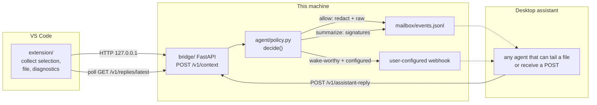

# ide-pair-agent

A **local pair-programming bridge**: a VS Code extension captures editor context, a small Python agent decides what to send, and outbound adapters deliver that context to a desktop assistant you already run (anything that can read a file or receive a webhook). Replies can come back into the IDE.

This is a **personal systems scaffold**. The transport, redaction, mailbox, webhook hook, and a deterministic `decide()` policy are real. There is no LLM in this process and no generated coding answer.

```
Interview one-liner:
"I built a pair-programming bridge — extension + local agent + webhook/mailbox
protocol — so an external assistant can see selection/diagnostics and answer
in-context."
```

## What this is not

- Not a Cursor product, clone, or affiliation.
- Not an official Grok Bot / xAI integration and not a claim about proprietary Bot internals.
- Not a finished LLM. `decide()` is deterministic allow / drop / summarize / channel rules, not a model.
- Not a production service. There are no users, SLAs, or partner badges to cite.

## Architecture



**Trust boundary:** the extension only talks to loopback (`127.0.0.1` / `localhost`). The bridge redacts obvious secrets, then `decide()` chooses allow / drop / summarize and mailbox vs webhook. The assistant is *your* process, on *your* machine or *your* webhook.

## Policy (`decide()`)

`bridge/src/pair_bridge/agent/policy.py` is the portfolio hook. It does **not** write the assistant's answer.

| Decision | When |
| --- | --- |
| **drop** | Lockfile dump, binary-ish payload, `node_modules` / `.git` path, secrets-only leftover after redaction, or nothing to pair on (no selection / file / prompt / diagnostics). |
| **allow** | Normal pair context: source, diagnostics, and/or a question. Forward raw after redaction. |
| **summarize** | File content > 8k chars or selection > 4k chars. Replace the oversized field with signature extraction (imports / defs, or a head/tail excerpt). No invented prose. |
| **mailbox** | Every forwarded event. Local JSONL audit log an assistant can tail. |
| **webhook** | Only when `ASSISTANT_WEBHOOK_URL` is set **and** the event is wake-worthy: `ask`, any error diagnostic, or `share_file_diagnostics` with diagnostics. |

Dropped events are persisted for debug (`GET /v1/events`) but are not written to the mailbox and do not POST a webhook.

## Repository layout

| Path | Role |
| --- | --- |
| `extension/` | VS Code extension (TypeScript). Commands collect context and POST it. |
| `bridge/` | FastAPI process. Persist, redact, decide, mailbox, optional webhook, accept replies. |
| `bridge/src/pair_bridge/agent/policy.py` | `decide()` — allow/drop, summarize, channel choice. |
| `bridge/src/pair_bridge/agent/summarize.py` | Deterministic signature / excerpt extraction. |
| `bridge/src/pair_bridge/redact.py` | Regex prefixes + entropy / URL-userinfo / labeled `.env` scanners. |
| `mailbox/` | Default JSONL drop directory (`events.jsonl` at runtime). |
| `examples/` | Sample payloads for curl. |
| `.github/workflows/ci.yml` | pytest for the bridge; `npm test` compile smoke for the extension. |

## Protocol

`POST http://127.0.0.1:8765/v1/context`

```json
{
  "schema_version": "1",
  "intent": "share_selection | share_file_diagnostics | ask",
  "prompt": "optional question",
  "workspace": { "folder": "/path", "git_branch": "main" },
  "file": {
    "path": "src/app.py",
    "language_id": "python",
    "content": "optional full file",
    "selection": { "text": "…", "start_line": 1, "end_line": 10 }
  },
  "diagnostics": [
    { "severity": "error", "message": "…", "source": "tsc", "start_line": 4, "end_line": 4 }
  ],
  "client": { "name": "ide-pair-agent-extension", "version": "0.1.0" }
}
```

Other routes:

| Method | Path | Purpose |
| --- | --- | --- |
| `GET` | `/v1/health` | Liveness + whether a webhook URL is configured. |
| `POST` | `/v1/assistant-reply` | Assistant / automation pushes `{ context_id, text, source }`. |
| `GET` | `/v1/replies/latest?context_id=` | Extension polling (WebSocket is a later increment). |
| `GET` | `/v1/events` | In-memory events including drops (debug). |

Outbound mailbox line (JSONL) includes `type`, `context_id`, the redacted (and maybe summarized) `payload`, and `reply_to` pointing at the local `/v1/assistant-reply` URL.

## Demo: extension + bridge (loopback)

Requires Python 3.11+ and Node 20+. Keep the bridge on `127.0.0.1`.

### 1. Bridge

```bash
python3 -m venv .venv
source .venv/bin/activate    # Windows: .venv\Scripts\activate
cd bridge
python -m pip install -e ".[dev]"
cd ..
python -m pair_bridge
```

Health check:

```bash
curl -s http://127.0.0.1:8765/v1/health
```

### 2. Send context (curl)

Quiet share — **allow**, mailbox only (no webhook wake):

```bash
curl -s -X POST http://127.0.0.1:8765/v1/context \
  -H 'Content-Type: application/json' \
  -d @examples/context.share-selection.json
```

Ask — **allow**, mailbox, and webhook if `ASSISTANT_WEBHOOK_URL` is set:

```bash
curl -s -X POST http://127.0.0.1:8765/v1/context \
  -H 'Content-Type: application/json' \
  -d @examples/context.ask.json
```

Watch what an assistant would see:

```bash
tail -f mailbox/events.jsonl
```

### 3. Push a reply, then poll (simulates the desktop assistant)

```bash
# replace the context_id from the POST /v1/context response
curl -s -X POST http://127.0.0.1:8765/v1/assistant-reply \
  -H 'Content-Type: application/json' \
  -d '{"context_id":"replace-with-id","text":"Add a return type on greet.","source":"desktop-assistant"}'

curl -s 'http://127.0.0.1:8765/v1/replies/latest?context_id=replace-with-id'
```

`examples/assistant-reply.json` is the same shape if you prefer a file.

### 4. Extension

1. Leave the bridge running on `http://127.0.0.1:8765`.
2. `cd extension && npm install && npm run compile`
3. Open this repository in VS Code (or any VS Code-compatible host). This repo is **not** a Cursor product.
4. Run the **Run Pair Agent Extension** launch config (F5). A new Extension Development Host window opens.
5. Open a source file, then Command Palette:
   - **Pair Agent: Share Selection** — highlight code first
   - **Pair Agent: Share File + Diagnostics**
   - **Pair Agent: Ask Pair Agent**

The extension refuses non-loopback `idePairAgent.bridgeUrl`. It POSTs `/v1/context`, then polls `/v1/replies/latest`. A reply is shown in the **Pair Agent** output channel and a webview.

To finish the loop from another terminal while the extension is waiting:

```bash
curl -s -X POST http://127.0.0.1:8765/v1/assistant-reply \
  -H 'Content-Type: application/json' \
  -d '{"context_id":"<id from the output channel>","text":"Looks fine — add a type hint.","source":"curl"}'
```

`npm test` compiles TypeScript and runs a Node smoke test on the shared protocol helpers. There is no VS Code integration-test host here; `npm run compile` is the packaging check.

Optional Docker for the bridge only (still loopback on the host):

```bash
docker compose up --build
```

The compose file binds `127.0.0.1:8765` only.

## Point a webhook at a desktop assistant

This is how the bridge can *wake* an assistant you already run: **you** configure a URL that assistant already exposes. This repo does not invent or document unofficial Bot APIs.

1. In the assistant / automation, create an **inbound webhook** that accepts JSON. Use that product's own docs.
2. Copy `.env.example` to `.env` and set:

   ```bash
   ASSISTANT_WEBHOOK_URL=https://your-assistant.example/hooks/ide-context
   ```

3. Restart the bridge. Wake-worthy accepted events (see policy table) are POSTed with:

   - header `X-Pair-Agent-Event: ide.context`
   - JSON body `{ type, context_id, payload, reply_to, … }`

4. Have the assistant (or a tiny script it runs) read that body and later:

   ```http
   POST http://127.0.0.1:8765/v1/assistant-reply
   ```

   `reply_to` is loopback on purpose. The assistant must be able to reach this machine (same host, SSH tunnel, etc.).

If you do not set `ASSISTANT_WEBHOOK_URL`, the loop still works: the assistant tails `mailbox/events.jsonl`. Quiet shares (`share_selection` with no errors) stay mailbox-only even when a webhook is configured.

Webhook HMAC signing is **YOU IMPLEMENT** (see `bridge/src/pair_bridge/outbound/webhook.py`).

## Still open

| Location | What is left |
| --- | --- |
| `bridge/src/pair_bridge/outbound/webhook.py` | HMAC (or similar) so a receiver can authenticate the bridge. |

`decide()` and the extra redaction scanners are implemented. They are rules, not a model and not a DLP guarantee. **No generated coding answer.**

## Secrets hygiene

Outbound payloads (store, mailbox, webhook) run through `redact_context()` first. The list covers common assignment shapes, well-known prefixes (`sk-`, `ghp_`, `glpat-`, PEM blocks, JWTs, …), URL userinfo, labeled `.env` secret keys, and a conservative high-entropy token scanner.

This is **not** a DLP product. Treat it as "don't be the person who JSONL'd a live key into a demo file." Never log the pre-redact payload.

## Tests and CI

```bash
# bridge
cd bridge && python -m pip install -e ".[dev]" && pytest && cd ..

# extension compile + protocol smoke
cd extension && npm test
```

GitHub Actions runs both jobs on pull requests.

## Interview talking points

- **Why a local bridge:** editor context is sensitive. Loopback + an explicit policy layer is a clearer story than "the IDE phones a cloud."
- **Three processes, one protocol:** collector (extension), policy (agent), delivery (mailbox/webhook). You can replace the assistant without rewriting the IDE side.
- **Mailbox vs webhook:** mailbox is an audit log an assistant can tail; webhook is a wake-up for questions and errors. Neither is a vendor SDK.
- **Policy as a seam:** `decide()` is deterministic and testable. That is better than a hardcoded "LGTM" string pretending to be an LLM.
- **Replies are inbound:** the bridge does not impersonate the assistant. Automation posts `/v1/assistant-reply`; the extension polls. Easy to demo with curl.
- **What I would do next:** HMAC on the webhook, optional WebSocket instead of poll, and an allowlist of workspace roots.

## Honesty constraints

Cite this repo as a **personal systems scaffold**. Do not say:

- you work at Cursor, or that this uses Cursor's agent stack
- this is an official Grok Bot partnership or that you reverse-engineered Bot internals
- there are production users, revenue, or uptime numbers
- the redactor "guarantees" secrets never leak
- `decide()` is a completed model or that it generates coding answers

If asked what a desktop assistant has to do with it: *any* process that can read JSONL or receive a user-configured webhook can sit on the other side. Naming a commercial bot is an example of that class, not a dependency of this repository.

## License

MIT. See [LICENSE](LICENSE).
