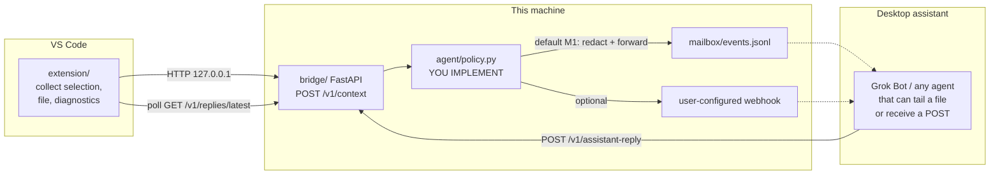

# ide-pair-agent

A **local pair-programming bridge**: a VS Code extension captures editor context, a small Python agent decides what to send, and outbound adapters deliver that context to a desktop assistant you already run (Grok Bot or anything that can read a file / receive a webhook). Replies can come back into the IDE.

This is an **M1 scaffold**. The transport, redaction stub, mailbox, and webhook hook are real. The "brain" is intentionally not.

```
Interview one-liner:
"I built a pair-programming bridge — extension + local agent + webhook/mailbox
protocol — so an external assistant can see selection/diagnostics and answer
in-context."
```

## What this is not

- Not a Cursor product, clone, or affiliation.
- Not an official Grok Bot / xAI integration and not a claim about proprietary Bot internals.
- Not a finished LLM. `decide()` raises `NotImplementedError` on purpose.
- Not a production service. There are no users, SLAs, or partner badges to cite.

## Architecture



**Trust boundary:** the extension only talks to loopback. The bridge redacts obvious secrets before writing the mailbox or POSTing a webhook. The assistant is *your* process, on *your* machine or *your* webhook.

## Repository layout

| Path | Role |
| --- | --- |
| `extension/` | VS Code extension (TypeScript). Commands collect context and POST it. |
| `bridge/` | FastAPI process. Persist, redact, mailbox, optional webhook, accept replies. |
| `bridge/src/pair_bridge/agent/policy.py` | **YOU IMPLEMENT** — allow/drop, summarize, channel choice. |
| `bridge/src/pair_bridge/redact.py` | Simple regex redaction + **YOU IMPLEMENT** stronger scanners. |
| `mailbox/` | Default JSONL drop directory (`events.jsonl` at runtime). |
| `examples/` | Sample payloads for curl. |
| `.github/workflows/ci.yml` | pytest for the bridge; `npm test` compile smoke for the extension. |

## Protocol (M1)

`POST http://127.0.0.1:8765/v1/context`

```json
{
  "schema_version": "1",
  "intent": "share_selection | share_file_diagnostics | ask",
  "prompt": "optional question",
  "workspace": { "folder": "/path", "git_branch": "main" },
  "file": {
    "path": "src/app.py",
    "language_id": "python",
    "content": "optional full file",
    "selection": { "text": "…", "start_line": 1, "end_line": 10 }
  },
  "diagnostics": [
    { "severity": "error", "message": "…", "source": "tsc", "start_line": 4, "end_line": 4 }
  ],
  "client": { "name": "ide-pair-agent-extension", "version": "0.1.0" }
}
```

Other routes:

| Method | Path | Purpose |
| --- | --- | --- |
| `GET` | `/v1/health` | Liveness + whether a webhook URL is configured. |
| `POST` | `/v1/assistant-reply` | Assistant / automation pushes `{ context_id, text, source }`. |
| `GET` | `/v1/replies/latest?context_id=` | Extension polling (WebSocket is a later increment). |
| `GET` | `/v1/events` | In-memory accepted events (debug). |

Outbound mailbox line (JSONL) includes `type`, `context_id`, the redacted `payload`, and `reply_to` pointing at the local `/v1/assistant-reply` URL.

## Run the bridge

Requires Python 3.11+.

```bash
python3 -m venv .venv
source .venv/bin/activate    # Windows: .venv\Scripts\activate
cd bridge
python -m pip install -e ".[dev]"
cd ..
python -m pair_bridge
```

Health check:

```bash
curl -s http://127.0.0.1:8765/v1/health
```

Send a fixture:

```bash
curl -s -X POST http://127.0.0.1:8765/v1/context \
  -H 'Content-Type: application/json' \
  -d @examples/context.share-selection.json
```

Watch what an assistant would see:

```bash
tail -f mailbox/events.jsonl
```

Push a fake reply (simulates the desktop assistant):

```bash
# replace the context_id
curl -s -X POST http://127.0.0.1:8765/v1/assistant-reply \
  -H 'Content-Type: application/json' \
  -d @examples/assistant-reply.json
```

Optional Docker:

```bash
docker compose up --build
```

The compose file binds `127.0.0.1:8765` only.

## Run the extension

1. Start the bridge (above).
2. `cd extension && npm install && npm run compile`
3. Open this repository in VS Code / Cursor.
4. Run the **Run Pair Agent Extension** launch config (F5). A new Extension Development Host window opens.
5. Command Palette:
   - **Pair Agent: Share Selection**
   - **Pair Agent: Share File + Diagnostics**
   - **Pair Agent: Ask Pair Agent**

The extension POSTs to `idePairAgent.bridgeUrl` (default `http://127.0.0.1:8765`), then polls `/v1/replies/latest`. A reply is shown in the **Pair Agent** output channel and a webview.

`npm test` compiles TypeScript and runs a Node smoke test on the shared protocol helpers. There is no VS Code integration-test host in M1; `npm run compile` is the packaging check.

## Point a webhook at a desktop assistant

This is how the bridge can *wake* Grok Bot (or anything else): **you** configure a URL the assistant already exposes.

1. In the assistant / automation, create an **inbound webhook** that accepts JSON. Use that product's own docs. This repo does not invent or document unofficial Bot APIs.
2. Copy `.env.example` to `.env` and set:

   ```bash
   ASSISTANT_WEBHOOK_URL=https://your-assistant.example/hooks/ide-context
   ```

3. Restart the bridge. Each accepted context event is POSTed with:

   - header `X-Pair-Agent-Event: ide.context`
   - JSON body `{ type, context_id, payload, reply_to, … }`

4. Have the assistant (or a tiny script it runs) read that body and later:

   ```http
   POST http://127.0.0.1:8765/v1/assistant-reply
   ```

   `reply_to` is loopback on purpose. The assistant must be able to reach this machine (same host, SSH tunnel, etc.).

If you do not set `ASSISTANT_WEBHOOK_URL`, M1 still works: the assistant tails `mailbox/events.jsonl`.

Webhook HMAC signing is **YOU IMPLEMENT** (see `bridge/src/pair_bridge/outbound/webhook.py`).

## YOU IMPLEMENT map

Do not ship a fake finished brain. These markers are the next honest increment:

| Location | What to build |
| --- | --- |
| `bridge/src/pair_bridge/agent/policy.py` → `decide()` | Allow/drop, summarize-or-raw, mailbox vs webhook. Raises `NotImplementedError` with steps. |
| `bridge/src/pair_bridge/redact.py` → `extra_redaction_rules()` | Entropy, structured `.env`/YAML walk, reviewed prefix lists. |
| `bridge/src/pair_bridge/outbound/webhook.py` | HMAC (or similar) so a receiver can authenticate the bridge. |

M1 behavior while those raise: redact with the regex stub, persist the event, write the mailbox, POST the webhook if configured. **No generated coding answer.**

## Secrets hygiene

Outbound payloads (store, mailbox, webhook) run through `redact_context()` first. The M1 list covers common assignment shapes and a few well-known prefixes (`sk-`, `ghp_`, PEM blocks, …).

This is a **stub**, not a DLP product. Treat it as "don't be the person who JSONL'd a live key into a demo file." Improvements are marked YOU IMPLEMENT. Never log the pre-redact payload.

## Tests and CI

```bash
# bridge
cd bridge && python -m pip install -e ".[dev]" && pytest && cd ..

# extension compile + protocol smoke
cd extension && npm test
```

GitHub Actions runs both jobs on pull requests.

## Interview talking points

- **Why a local bridge:** editor context is sensitive. Loopback + an explicit policy layer is a clearer story than "the IDE phones a cloud."
- **Three processes, one protocol:** collector (extension), policy (agent), delivery (mailbox/webhook). You can replace the assistant without rewriting the IDE side.
- **Mailbox vs webhook:** mailbox is an audit log an assistant can tail; webhook is a wake-up. M1 supports both without pretending either is a vendor SDK.
- **Policy as a seam:** `decide()` is unfinished on purpose. That is better than a hardcoded "LGTM" string pretending to be an LLM.
- **Replies are inbound:** the bridge does not impersonate the assistant. Automation posts `/v1/assistant-reply`; the extension polls. Easy to demo with curl.
- **What I would do next:** real `decide()`, HMAC on the webhook, better secret scanning, optional WebSocket, and a allowlist of workspace roots.

## Honesty constraints

Cite this repo as a **personal systems scaffold**. Do not say:

- you work at Cursor, or that this uses Cursor's agent stack
- this is an official Grok Bot partnership or that you reverse-engineered Bot internals
- there are production users, revenue, or uptime numbers
- the regex redactor "guarantees" secrets never leak
- `decide()` is a completed model

If asked what Grok Bot has to do with it: *any* desktop assistant that can read JSONL or receive a user-configured webhook can sit on the other side. Grok Bot is one example of that class, not a dependency of this repository.

## License

MIT. See [LICENSE](LICENSE).
